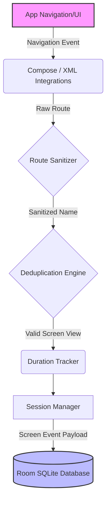

# Screen Analytics SDK


An enterprise-grade, **zero-boilerplate**, offline-first screen analytics SDK for modern Android applications. 

Designed for both **Jetpack Compose** and **Legacy XML (Activities/Fragments)**, this SDK automatically tracks user journeys without polluting your UI code with analytics calls.

---

## The Promise
> **Zero screen-level analytics boilerplate.**
> Integrate once at the Application/Navigation level. The SDK automatically detects screen transitions, resolves duplicate events, sanitizes routes, calculates screen duration, manages sessions, and persists everything locally using Room SQLite—all entirely offline.

---

## Installation (JitPack)

Add the JitPack repository to your root `settings.gradle.kts` or `build.gradle.kts`:

```kotlin
dependencyResolutionManagement {
    repositoriesMode.set(RepositoriesMode.FAIL_ON_PROJECT_REPOS)
    repositories {
        google()
        mavenCentral()
        maven("https://jitpack.io") // Add this
    }
}
```

Add the dependencies in your app's `build.gradle.kts`:

```kotlin
dependencies {
    // Core Engine (Required)
    implementation("com.github.gargpadmakar.screen-analytics-android:screen-analytics-core:1.0.5")
    
    // SQLite Storage (Required)
    implementation("com.github.gargpadmakar.screen-analytics-android:screen-analytics-storage:1.0.5")

    // Legacy XML Support (Activities/Fragments)
    implementation("com.github.gargpadmakar.screen-analytics-android:screen-analytics-android:1.0.5")

    // Jetpack Compose Support (Navigation Compose)
    implementation("com.github.gargpadmakar.screen-analytics-android:screen-analytics-compose:1.0.5")
}
```

---

## Quick Start

### 1. Global Initialization
Initialize the Core SDK inside your `Application` class.

```kotlin
import android.app.Application
import com.example.screenanalytics.core.ScreenAnalyticsCore
import com.example.screenanalytics.storage.AnalyticsRepositoryImpl
import com.example.screenanalytics.storage.AnalyticsDatabase

class MyApplication : Application() {
    override fun onCreate() {
        super.onCreate()
        
        // Initialize the Room-backed repository
        val db = AnalyticsDatabase.getDatabase(this)
        val repository = AnalyticsRepositoryImpl(db.analyticsEventDao())
        
        // Initialize the Core Engine
        ScreenAnalyticsCore.init(repository)
    }
}
```

### 2. Track Jetpack Compose (Zero Boilerplate)
Attach the tracker once to your `NavController`. You **do not** need to add tracking code inside your `@Composable` functions!

```kotlin
import androidx.compose.runtime.Composable
import androidx.navigation.compose.NavHost
import androidx.navigation.compose.composable
import androidx.navigation.compose.rememberNavController
import com.example.screenanalytics.compose.ScreenAnalyticsCompose

@Composable
fun AppNavigation() {
    val navController = rememberNavController()

    // Attach analytics once
    ScreenAnalyticsCompose.attach(navController)

    NavHost(navController = navController, startDestination = "home") {
        // These screens are automatically tracked when visited
        composable("home") { HomeScreen() }
        composable("profile") { ProfileScreen() }
    }
}
```

### 3. Track Activities & Fragments (Zero Boilerplate)
For legacy apps, attach the tracker inside your `Application` class.

```kotlin
import com.example.screenanalytics.android.ScreenAnalytics

class MyApplication : Application() {
    override fun onCreate() {
        super.onCreate()
        // ... (Core init)
        
        // Automatically track all Activities and Child Fragments
        ScreenAnalytics.startActivityTracking(this, trackFragments = true)
    }
}
```

---

## Architecture

The SDK uses a clean, offline-first architecture decoupled from any specific transport mechanism (e.g., Firebase, REST).



### Route Sanitization & Deduplication
If your Compose app routes to `profile/{userId}?tab=settings`, the SDK's **Route Sanitizer** intercepts it, preventing PII leaks and normalizing the data before it hits the database. Concurrently, the **Deduplication Engine** prevents double-logging if an Activity and a Fragment recreate rapidly on a configuration change.

---

## Local Analytics Engine & Export

The SDK aggregates data completely offline using raw SQLite speed. You can easily query statistics to build local developer dashboards or export reports to CSV/JSON.

```kotlin
import com.example.screenanalytics.core.ScreenAnalyticsCore
import com.example.screenanalytics.core.AnalyticsExportManager
import kotlinx.coroutines.launch

// 1. Get real-time Local Statistics
coroutineScope.launch {
    val stats = ScreenAnalyticsCore.repository.getScreenStatistics()
    stats.forEach { 
        println("${it.screenName} viewed ${it.viewCount} times. Avg duration: ${it.averageDurationMillis}ms")
    }
}

// 2. Export raw data offline
coroutineScope.launch {
    val rawEvents = ScreenAnalyticsCore.repository.getAllEvents()
    val csvData = AnalyticsExportManager.exportCsv(rawEvents)
    println(csvData)
}
```

---

## Privacy & Compliance
This SDK is strictly designed for modern privacy requirements:
* **No Network Dependency:** It does not pack Retrofit, OkHttp, or any hidden background uploaders.
* **No Permissions Needed:** Doesn't require `INTERNET`, `ACCESS_FINE_LOCATION`, etc.
* **No PII Collection:** Will never collect Contacts, Phone Numbers, or exact coordinates.
* **Route Anonymization:** Standardizes dynamic routes preventing database injection of private identifiers.

## Contributing
1. Fork it
2. Create your feature branch (`git checkout -b feature/fooBar`)
3. Commit your changes (`git commit -am 'Add some fooBar'`)
4. Push to the branch (`git push origin feature/fooBar`)
5. Create a new Pull Request
