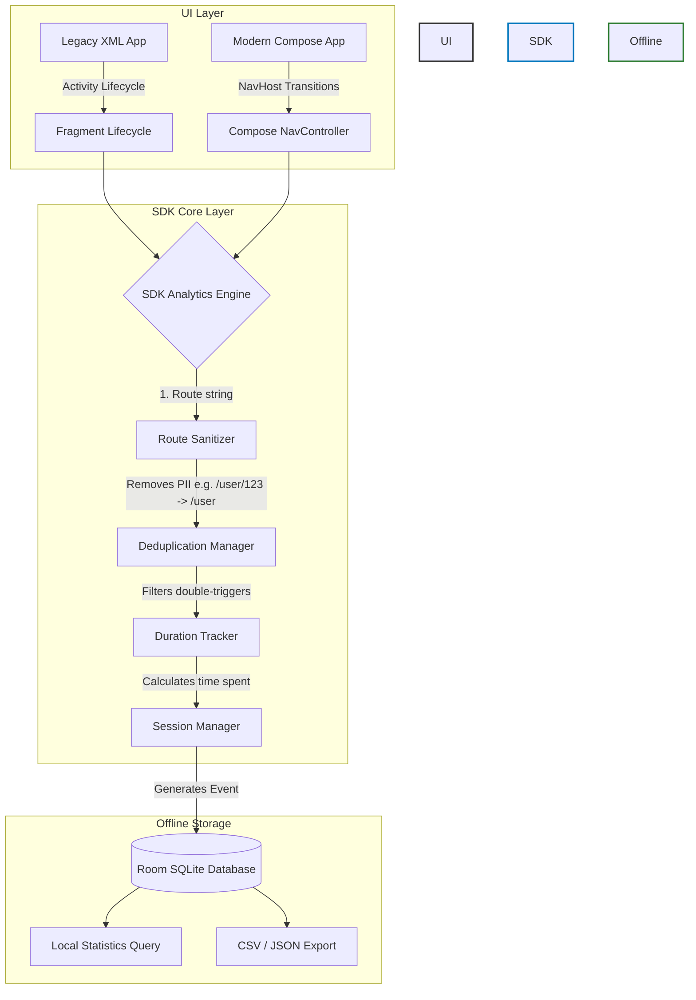

# Screen Analytics SDK


An enterprise-grade, **zero-boilerplate**, offline-first screen analytics SDK for modern Android applications. 

---

## What is the use of this SDK?

When building Android applications, product managers and developers need to know:
1. Which screens are users visiting the most?
2. How much time (duration) are users spending on a specific screen?
3. What does the user journey (screen flow) look like?

**The Problem:** Normally, developers have to manually write `analytics.trackScreen("Home")` inside every single Activity, Fragment, and Jetpack Compose screen. This creates massive code duplication, pollutes the UI logic, and makes the codebase hard to maintain.

**The Solution:** This SDK automatically tracks user journeys **without polluting your UI code with analytics calls**. You initialize it once at the Application level, and it automatically intercepts Android Lifecycle events and Jetpack Compose navigation events to track screens, calculate durations, and manage sessions entirely offline in a local SQLite database.

---

## How it works (Architecture)

The SDK acts as a centralized engine that listens to your app's natural navigation. It standardizes the data and saves it securely.



---

## Installation (JitPack)

Add the JitPack repository to your root `settings.gradle.kts` or `build.gradle.kts`:

```kotlin
dependencyResolutionManagement {
    repositoriesMode.set(RepositoriesMode.FAIL_ON_PROJECT_REPOS)
    repositories {
        google()
        mavenCentral()
        maven("https://jitpack.io") // Add this
    }
}
```

Add the dependencies in your app's `build.gradle.kts`:

```kotlin
dependencies {
    // Core Engine & Storage (Required)
    implementation("com.github.gargpadmakar.screen-analytics-android:screen-analytics-core:1.0.6")
    implementation("com.github.gargpadmakar.screen-analytics-android:screen-analytics-storage:1.0.6")

    // Legacy XML Support (Activities/Fragments)
    implementation("com.github.gargpadmakar.screen-analytics-android:screen-analytics-android:1.0.6")

    // Jetpack Compose Support (Navigation Compose)
    implementation("com.github.gargpadmakar.screen-analytics-android:screen-analytics-compose:1.0.6")
}
```

---

## Quick Start Guide

### 1. Global Initialization
Initialize the Core SDK inside your `Application` class.

```kotlin
import android.app.Application
import com.example.screenanalytics.core.ScreenAnalyticsCore
import com.example.screenanalytics.storage.AnalyticsRepositoryImpl
import com.example.screenanalytics.storage.AnalyticsDatabase

class MyApplication : Application() {
    override fun onCreate() {
        super.onCreate()
        
        // Initialize the Room-backed repository
        val db = AnalyticsDatabase.getDatabase(this)
        val repository = AnalyticsRepositoryImpl(db.analyticsEventDao())
        
        // Initialize the Core Engine
        ScreenAnalyticsCore.init(repository)
    }
}
```

### 2. Track Jetpack Compose (Zero Boilerplate)
Attach the tracker once to your `NavController`. You **do not** need to add tracking code inside your `@Composable` functions!

```kotlin
import androidx.compose.runtime.Composable
import androidx.navigation.compose.NavHost
import androidx.navigation.compose.composable
import androidx.navigation.compose.rememberNavController
import com.example.screenanalytics.compose.ScreenAnalyticsCompose

@Composable
fun AppNavigation() {
    val navController = rememberNavController()

    // Attach analytics once
    ScreenAnalyticsCompose.attach(navController)

    NavHost(navController = navController, startDestination = "home") {
        // These screens are automatically tracked when visited
        composable("home") { HomeScreen() }
        composable("profile") { ProfileScreen() }
    }
}
```

### 3. Track Activities & Fragments (Zero Boilerplate)
For legacy apps, attach the tracker inside your `Application` class.

```kotlin
import com.example.screenanalytics.android.ScreenAnalytics

class MyApplication : Application() {
    override fun onCreate() {
        super.onCreate()
        // ... (Core init)
        
        // Automatically track all Activities and Child Fragments
        ScreenAnalytics.startActivityTracking(this, trackFragments = true)
    }
}
```

---

## Deep Dive: Local Analytics Engine & Export

Because this SDK is offline-first, you can aggregate data completely offline using raw SQLite speed. You can easily query statistics to build local developer dashboards or export reports to CSV/JSON.

```kotlin
import com.example.screenanalytics.core.ScreenAnalyticsCore
import com.example.screenanalytics.core.AnalyticsExportManager
import kotlinx.coroutines.launch

// 1. Get real-time Local Statistics
coroutineScope.launch {
    val stats = ScreenAnalyticsCore.repository.getScreenStatistics()
    stats.forEach { 
        println("${it.screenName} viewed ${it.viewCount} times. Avg duration: ${it.averageDurationMillis}ms")
    }
}

// 2. Export raw data offline
coroutineScope.launch {
    val rawEvents = ScreenAnalyticsCore.repository.getAllEvents()
    val csvData = AnalyticsExportManager.exportCsv(rawEvents)
    println(csvData)
}
```

---

## Privacy & Compliance
This SDK is strictly designed for modern privacy requirements:
* **No Network Dependency:** It does not pack Retrofit, OkHttp, or any hidden background uploaders.
* **No Permissions Needed:** Doesn't require `INTERNET`, `ACCESS_FINE_LOCATION`, etc.
* **No PII Collection:** Will never collect Contacts, Phone Numbers, or exact coordinates.
* **Route Anonymization:** Standardizes dynamic routes preventing database injection of private identifiers.

## 📱 Sample Apps

This repository contains two fully working sample applications so you can see the SDK in action:

1. **`sample-compose-app`**: A beautiful, premium light-themed Jetpack Compose app featuring a bottom navigation bar, dynamic nested routes (`product_detail/123`), and a real-time developer dashboard that automatically updates as you navigate. It also demonstrates how to export SQLite data to a CSV file.
2. **`sample-xml-app`**: A classic XML-based application demonstrating how `Application.ActivityLifecycleCallbacks` can magically track all Activities (`MainActivity`, `DetailActivity`) with zero boilerplate.

### 📸 Screenshots
<div align="center">
  
  
</div>

---

## Support

If this SDK saved you time, consider buying me a coffee to support my open-source work!

<a href="https://buymeacoffee.com/padmakargarg" target="_blank"></a>
